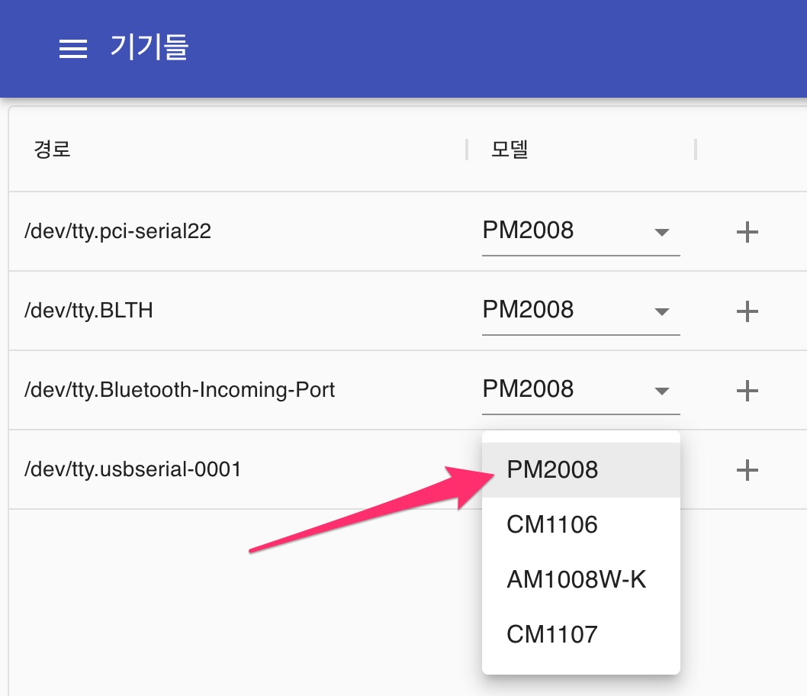
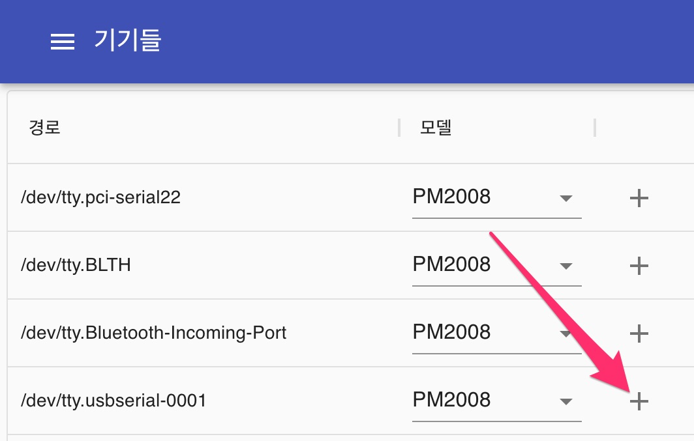
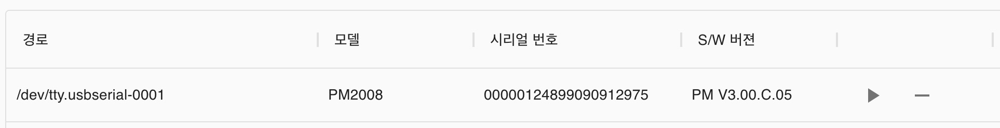
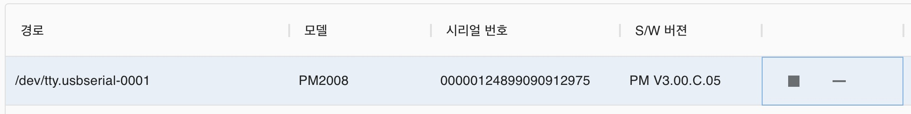
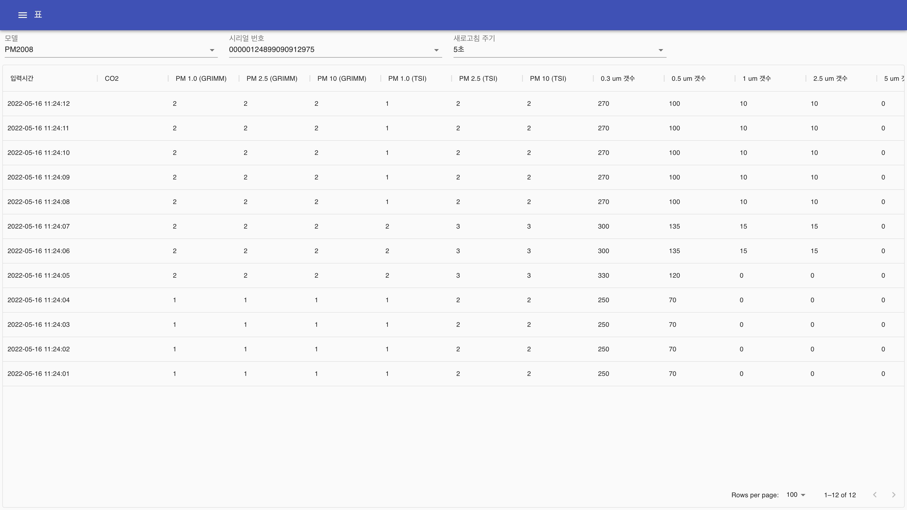
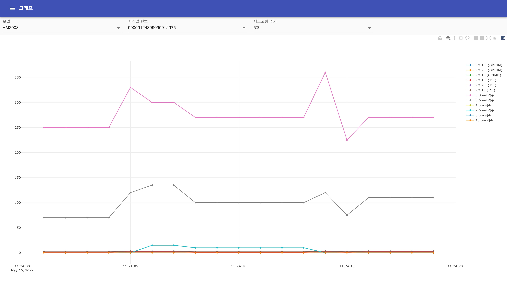
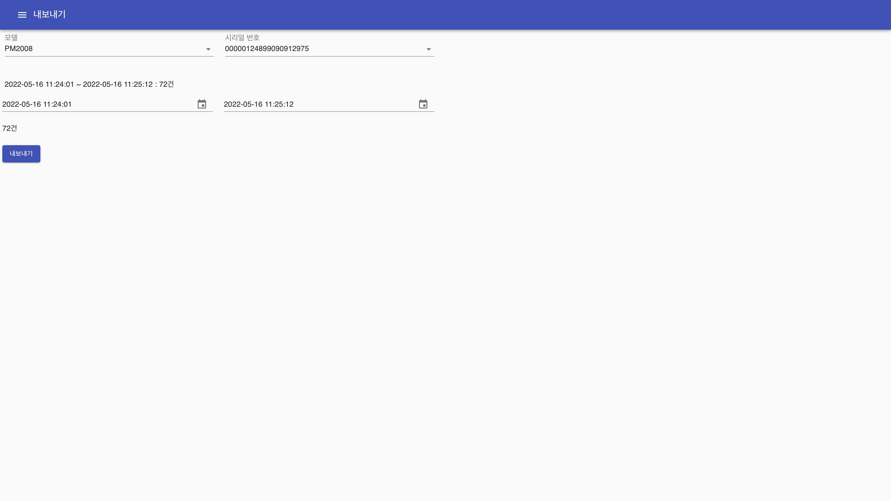

# CUBIC monitor

CUBIC 센서 중 UART 통신 가능 제품의 데이터를 저장하고 확인할 수 있는 프로그램

## 지원 모델

- PM2008 (PM2008M, PM2009, PM2012)
- CM1106 (CM1109)
- CM1107
- AM1008W-K (AM1008W-K-P)
- CB-HCHO-V4.0
- AM1002

## 설치

- [릴리즈 페이지](https://github.com/neosarchizo/cubic-monitor/releases) 이동

### macOS

- `dmg` 파일 다운로드 및 설치
- 실행 후 먼저 `표` 또는 `그래프` 페이지로 이동

### Windows

- `exe` 파일 다운로드 및 설치

## 사용방법

### 기기들 페이지

1. 프로그램 실행 후 `새로고침` 버튼 클릭

2. 검색된 포트 중 연결할 포트의 모델을 선택

3. 모델 선택 후 `추가` 버튼 클릭

4. `추가` 버튼 클릭 후 하단에 기기가 추가됨. 정상적으로 추가될시 `시리얼 번호`와 `S/W 버젼`이 표시됨. 여기서 `실행` 버튼을 클릭하면 데이터 통신이 시작됨.

### 표 페이지

- 가장 최신 데이터 1000개를 표로 확인 가능
- `모델` 설정 가능
- `시리얼 번호` 설정 가능
- `새로고침 주기` 설정 가능
  - 현재 통신 중인 경우 이 주기에 맞춰 새로고침함
  - 5초
  - 10초
  - 30초
  - 1분

### 그래프 페이지

- 가장 최신 데이터 1000개를 그래프로 확인 가능
- `모델` 설정 가능
- `시리얼 번호` 설정 가능
- `새로고침 주기` 설정 가능
  - 현재 통신 중인 경우 이 주기에 맞춰 새로고침함
  - 5초
  - 10초
  - 30초
  - 1분

### 내보내기 페이지

- 원하는 구간의 데이터를 엑셀로 내보내기 가능
- `모델` 설정 가능
- `시리얼 번호` 설정 가능
- `구간` 설정 가능

